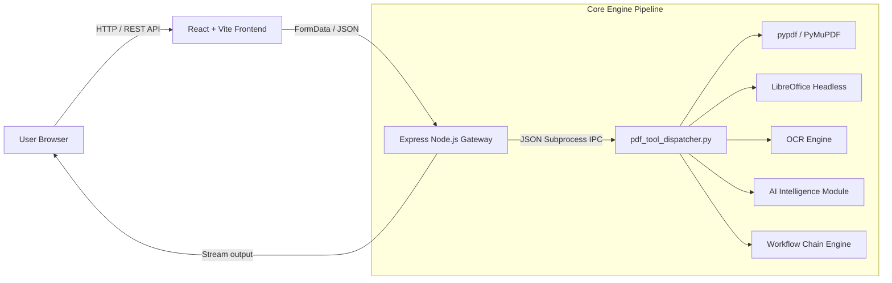

<div align="center">

# 🚀 34-in-1 PDF Studio Suite & Visual Workflow Engine

### Enterprise-Grade Open Source PDF Tool House, Technical SEO 100/100 & Visual Automation Engine

An all-in-one, privacy-focused PDF processing platform featuring **34 powerful PDF tools**, an intuitive **Visual Workflow Automation Pipeline**, **AI-powered intelligence**, **OCR processing**, **native Office conversions**, **custom SaaS color palette**, and a **production-ready multi-stage Docker setup**.

[](https://www.docker.com/)
[](https://nodejs.org/)
[](https://www.python.org/)
[](https://react.dev/)
[](https://docuconvertpro.onrender.com/sitemap.xml)
[](LICENSE)

[Features](#-features) • [Tool Categories](#-tool-categories) • [Technical SEO](#-technical-seo--pwa) • [Quick Start](#-quick-start) • [Docker & Cloud](#-cloud-deployment) • [Architecture](#-architecture)

</div>

---

> [!NOTE]
> **100% Privacy & Local Execution**: DocuConvert Pro processes all your files directly within your deployment instance. Zero external SaaS API calls or third-party tracking.

---

## ✨ Features & Recent Upgrades

- 🛠️ **34 PDF Tools**: Comprehensive suite covering Organize, Optimize, Convert to/from PDF, Edit, Security, and AI Intelligence.
- ⚡ **Visual Workflow Builder**: Pipeline engine to chain multiple operations (`Merge ➔ Compress ➔ Watermark ➔ Protect`).
- 🤖 **AI PDF Intelligence**: Instant document summarization, multi-language translation, and structured Markdown extraction.
- 🔍 **OCR Engine**: Convert scanned documents into fully searchable PDFs with active selection layers.
- 🎨 **Custom SaaS Palette**: Custom theme palette featuring **Gunmetal** (`#2e3532`), **Dark Amaranth** (`#8b2635`), **Soft Linen** (`#e0e2db`), **Dust Grey** (`#d2d4c8`), and **Tea Green** (`#d3efbd`) with Light & Dark mode toggle.
- 📊 **Animated Progress Bar**: Real-time progress percentage indicators and step status tracking during file conversions.
- 📈 **100/100 Technical SEO**: Unique SEO landing pages, clean URLs, JSON-LD Schema (`SoftwareApplication`, `FAQPage`, `BreadcrumbList`), dynamic `sitemap.xml`, `robots.txt`, and PWA Web App Manifest.
- 🐳 **Production Docker Setup**: Multi-stage build (`node:22-alpine` + `python:3.12-slim-bookworm`), non-root execution (`appuser`), `/health` probes, and Docker Compose local orchestration.
- ☁️ **Deploy Anywhere**: 1-Click Render Blueprint (`render.yaml`), Northflank, Railway, and Google Cloud Run compatible.

---

## 📚 Tool Categories (34 Tools)

### 📁 1. Organize PDF
| Tool | Slug | Description |
| :--- | :--- | :--- |
| **Merge PDF** | `/merge-pdf` | Combine multiple PDF files into one unified document |
| **Split PDF** | `/split-pdf` | Separate PDF pages or extract custom page ranges (`1-3, 5`) |
| **Remove Pages** | `/remove-pages` | Delete specific unwanted pages from your document |
| **Extract Pages** | `/extract-pages` | Isolate selected page numbers into a new PDF |
| **Organize PDF** | `/organize-pdf` | Reorder, rotate, or delete pages with interactive preview |
| **Scan to PDF** | `/scan-to-pdf` | Convert images or PDFs into black & white scanned style |

### ⚡ 2. Optimize PDF
| Tool | Slug | Description |
| :--- | :--- | :--- |
| **Compress PDF** | `/compress-pdf` | Reduce file size while keeping visual crispness |
| **Repair PDF** | `/repair-pdf` | Rebuild corrupt, damaged, or unreadable PDF xref tables |
| **OCR PDF** | `/ocr-pdf` | Convert scanned PDFs into searchable text documents |

### 🔄 3. Convert to PDF
| Tool | Slug | Engine Used |
| :--- | :--- | :--- |
| **JPG to PDF** | `/jpg-to-pdf` | Convert JPG, PNG, WEBP, or BMP images into PDF |
| **Word to PDF** | `/word-to-pdf` | Convert `.docx` and `.doc` files via LibreOffice / Word COM |
| **PowerPoint to PDF** | `/ppt-to-pdf` | Convert `.pptx` and `.ppt` presentations to PDF slides |
| **Excel to PDF** | `/excel-to-pdf` | Convert `.xlsx` and `.xls` spreadsheets to vector PDF tables |
| **HTML to PDF** | `/html-to-pdf` | Convert raw HTML snippets or web pages to PDF |

### 🔄 4. Convert from PDF
| Tool | Slug | Output Format |
| :--- | :--- | :--- |
| **PDF to JPG** | `/pdf-to-jpg` | Extract all pages into high-resolution JPG images (150/300 DPI) |
| **PDF to Word** | `/pdf-to-word` | Extract layout and text into editable Word (`.docx`) files |
| **PDF to PowerPoint**| `/pdf-to-powerpoint`| Convert PDF pages into presentation slides (`.pptx`) |
| **PDF to Excel** | `/pdf-to-excel` | Extract data tables directly into spreadsheets (`.xlsx`) |
| **PDF to PDF/A** | `/pdf-to-pdfa` | Convert standard PDFs into ISO-compliant archival format |

### ✏️ 5. Edit PDF
| Tool | Slug | Customization |
| :--- | :--- | :--- |
| **Rotate PDF** | `/rotate-pdf` | Rotate document pages by 90°, 180°, or 270° degrees |
| **Add Page Numbers** | `/add-page-numbers` | Stamp page numbers (`Page X of Y`) on header/footer |
| **Add Watermark** | `/add-watermark` | Stamp diagonal text watermarks (`CONFIDENTIAL`, `DRAFT`) |
| **Crop PDF** | `/crop-pdf` | Trim page margins and bounding box coordinates |
| **Edit PDF Text** | `/edit-pdf-text` | Overlay custom text annotations and notes on pages |
| **PDF Forms** | `/pdf-forms` | Fill interactive AcroForm fields and export updated files |

### 🔒 6. PDF Security
| Tool | Slug | Security Standard |
| :--- | :--- | :--- |
| **Unlock PDF** | `/unlock-pdf` | Remove owner passwords and permission restrictions |
| **Protect PDF** | `/protect-pdf` | Encrypt PDFs with strong user passwords (128/256-bit AES) |
| **Sign PDF** | `/sign-pdf` | Apply electronic signatures and verification stamps |
| **Redact PDF** | `/redact-pdf` | Permanently blackout sensitive keywords (SSNs, names) |
| **Compare PDF** | `/compare-pdf` | Compare 2 PDFs side-by-side to highlight text diffs |

### 🤖 7. AI Intelligence
| Tool | Slug | Output |
| :--- | :--- | :--- |
| **AI Summarizer** | `/ai-summary` | Generate executive summaries and word metrics |
| **Translate PDF** | `/translate-pdf` | Translate PDF text into target languages (ES, FR, DE, HI, JA, ZH) |
| **PDF to Markdown** | `/pdf-to-markdown` | Extract structured Markdown (`.md`) text with headings |

---

## 📈 Technical SEO & PWA

DocuConvert Pro includes an enterprise-grade technical SEO architecture:

- **Dynamic Sitemap**: Serves `/sitemap.xml` dynamically generated for all 34 tools + homepage.
- **Robots.txt**: Serves `/robots.txt` guiding search engine crawlers.
- **JSON-LD Schema**: Implements `SoftwareApplication`, `Organization`, `BreadcrumbList`, and `FAQPage` schemas.
- **PWA Ready**: Web App Manifest (`/manifest.webmanifest`) and standalone app support.

---

## 🏗 Architecture



---

## 🚀 Quick Start (Local & Docker)

### 1. Run via Docker Compose (Recommended)
```bash
docker compose up -d
```
Open **`http://localhost:5000`** in your browser.

### 2. Manual Development Setup
```bash
npm run install:all
npm run dev
```

---

## ☁️ Deploy Anywhere

- ✅ **Render** (Includes `render.yaml` for 1-Click Blueprint deployments)
- ✅ **Northflank** (Connect repo ➔ Select Docker build ➔ Port `5000` & `/health` check)
- ✅ **Railway & Google Cloud Run**

---

## 📜 License & Author

Distributed under the MIT License. Made with ❤️ by [reck98](https://github.com/reck98).
