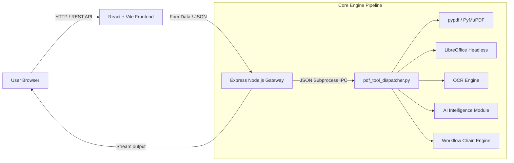

<div align="center">

# 🚀 34-in-1 PDF Studio Suite

### Enterprise-Grade Open Source PDF Tool House & Visual Workflow Automation Engine

An all-in-one, privacy-focused PDF processing platform featuring **34 powerful PDF tools**, an intuitive **Visual Workflow Automation Pipeline**, **AI-powered intelligence**, **OCR processing**, **native Office conversions**, and a **production-ready multi-stage Docker setup**.

[](https://www.docker.com/)
[](https://nodejs.org/)
[](https://www.python.org/)
[](https://react.dev/)
[](https://expressjs.com/)
[](LICENSE)
[](CONTRIBUTING.md)

[Features](#-features) • [Tool Categories](#-tool-categories) • [Quick Start](#-quick-start) • [Docker & Cloud](#-cloud-deployment) • [Architecture](#-architecture) • [Workflow Engine](#-workflow-builder)

</div>

---

> [!NOTE]
> **100% Privacy & Local Execution**: DocuConvert PDF Studio processes all your files directly within your deployment instance. Zero external SaaS API calls or third-party tracking.

---

## ✨ Features

- 🛠️ **34 PDF Tools**: Comprehensive suite covering Organize, Optimize, Convert, Edit, Security, and AI.
- ⚡ **Workflow Builder**: Visual pipeline engine to chain multiple operations (`Merge ➔ Compress ➔ Watermark ➔ Protect`).
- 🤖 **AI PDF Intelligence**: Instant document summarization, multi-language translation, and structured Markdown extraction.
- 🔍 **OCR Engine**: Convert scanned documents into fully searchable PDFs with active selection layers.
- 💼 **Native Office Conversion**: High-fidelity conversion for Word (`.docx`), PowerPoint (`.pptx`), and Excel (`.xlsx`).
- 🔒 **Enterprise Security**: 128/256-bit AES password protection, unlocking, visual digital signatures, and permanent redaction.
- 🐳 **Production Docker Setup**: Multi-stage build, non-root execution (`appuser`), health check probes (`/health`), and layer caching.
- ☁️ **Deploy Anywhere**: Pre-configured for zero-code-change deployments to Northflank, Render, Railway, and Google Cloud Run.

---

## 📚 Tool Categories

### 📁 1. Organize PDF
| Tool | Description | Supported Inputs |
| :--- | :--- | :--- |
| **Merge PDF** | Combine multiple PDF files into one unified document | `.pdf` |
| **Split PDF** | Separate PDF pages or extract custom page ranges (`1-3, 5`) | `.pdf` |
| **Remove Pages** | Delete specific unwanted pages from your document | `.pdf` |
| **Extract Pages** | Isolate selected page numbers into a new PDF | `.pdf` |
| **Organize PDF** | Reorder, rotate, or delete pages with interactive preview | `.pdf` |
| **Scan to PDF** | Convert images or PDFs into black & white scanned style | `.pdf`, Images |

### ⚡ 2. Optimize PDF
| Tool | Description | Key Options |
| :--- | :--- | :--- |
| **Compress PDF** | Reduce file size while keeping visual crispness | Low / Medium / High |
| **Repair PDF** | Rebuild corrupt, damaged, or unreadable PDF xref tables | Automatic |
| **OCR PDF** | Convert scanned PDFs into searchable text documents | Multi-Language |

### 🔄 3. Convert to PDF
| Tool | Description | Engine Used |
| :--- | :--- | :--- |
| **JPG to PDF** | Convert JPG, PNG, WEBP, or BMP images into PDF | Pillow / img2pdf |
| **Word to PDF** | Convert `.docx` and `.doc` files to PDF | MS Word COM / LibreOffice |
| **PowerPoint to PDF** | Convert `.pptx` and `.ppt` presentations to PDF | MS PowerPoint COM / LibreOffice |
| **Excel to PDF** | Convert `.xlsx` and `.xls` spreadsheets to PDF | MS Excel COM / LibreOffice |
| **HTML to PDF** | Convert raw HTML snippets or web pages to PDF | PyMuPDF Render |

### 🔄 4. Convert from PDF
| Tool | Description | Output Format |
| :--- | :--- | :--- |
| **PDF to JPG** | Extract all pages into high-resolution JPG images | `.jpg` (150/300 DPI) |
| **PDF to Word** | Extract layout and text into editable Word documents | `.docx` |
| **PDF to PowerPoint** | Convert PDF pages into presentation slides | `.pptx` |
| **PDF to Excel** | Extract data tables directly into spreadsheets | `.xlsx` |
| **PDF to PDF/A** | Convert standard PDFs into ISO-compliant archival format | `.pdf` (PDF/A) |

### ✏️ 5. Edit PDF
| Tool | Description | Customization |
| :--- | :--- | :--- |
| **Rotate PDF** | Rotate document pages by 90°, 180°, or 270° degrees | Angle selector |
| **Add Page Numbers** | Stamp page numbers (`Page X of Y`) on header/footer | Position & Format |
| **Add Watermark** | Stamp diagonal text watermarks (`CONFIDENTIAL`, `DRAFT`) | Text & Opacity |
| **Crop PDF** | Trim page margins and bounding box coordinates | Top / Bottom px |
| **Edit PDF Text** | Overlay custom text annotations and notes on pages | Text & Location |
| **PDF Forms** | Fill interactive AcroForm fields and export updated files | Field Dictionary |

### 🔒 6. PDF Security
| Tool | Description | Security Standard |
| :--- | :--- | :--- |
| **Unlock PDF** | Remove owner passwords and permission restrictions | User Decryption |
| **Protect PDF** | Encrypt PDFs with strong user passwords | 128/256-bit AES |
| **Sign PDF** | Apply electronic signatures and verification stamps | Image / Text Stamp |
| **Redact PDF** | Permanently blackout sensitive keywords (SSN, names) | Permanent Blackout |
| **Compare PDF** | Compare 2 PDFs side-by-side to highlight text & layout diffs | Visual / Text Diff |

### 🤖 7. AI Intelligence
| Tool | Description | Output |
| :--- | :--- | :--- |
| **AI Summarizer** | Generate executive summaries and word metrics | Bullet Highlights |
| **Translate PDF** | Translate PDF document text into target languages | ES, FR, DE, HI, JA, ZH |
| **PDF to Markdown** | Extract structured Markdown text with headings and blocks | `.md` format |

---

## 🖼 Screenshots

| All 34 PDF Tools Dashboard | Visual Workflow Builder |
|:---:|:---:|
|  |  |

| Interactive Tool Runner Modal | In-Browser PDF Live Preview |
|:---:|:---:|
|  |  |

---

## 🏗 Architecture

The system is built as a high-throughput, containerized full-stack application.



### Component Breakdown

1. **Client Tier**: React 18 SPA built with Vite and TailwindCSS/Vanilla Glassmorphism design system. Serves category filters, search bars, tool modals, and workflow drag-and-drop chains.
2. **Gateway Tier**: Express (Node.js) server running on port `5000` listening on `0.0.0.0`. Handles file uploads (`multer`), stream zipping (`archiver`), and signals graceful shutdown (`SIGTERM`/`SIGINT`).
3. **Engine Tier**: Python 3.12 subprocess bridge dispatching operations to modular processing scripts (`pdf_organize`, `pdf_optimize`, `pdf_convert_to`, `pdf_security`, `pdf_ai`, `pdf_workflow`).

---

## 🧰 Tech Stack

| Category | Technologies Used |
| :--- | :--- |
| **Frontend** | React 18, Vite, Lucide Icons, Vanilla CSS Glassmorphic Tokens |
| **Backend API** | Node.js (v22.x), Express, Multer, Archiver, UUID |
| **PDF Processing** | `pypdf`, `pymupdf` (PyMuPDF), `pdfplumber`, `reportlab`, `pikepdf`, `img2pdf` |
| **Office Conversion**| LibreOffice Headless (Linux/Docker) / MS Office COM (Windows) |
| **AI & NLP** | RegEx Extractive NLP Summarizer, PyMuPDF Translation Layer |
| **Containerization** | Docker Multi-Stage (`node:22-alpine` + `python:3.12-slim-bookworm`) |
| **Cloud Deployment** | Northflank, Render, Railway, Google Cloud Run |

---

## 📂 Project Structure

```text
word-to-pdf/
├── Dockerfile                  # Multi-stage production Docker build manifest
├── .dockerignore               # Container file exclusion rules
├── package.json                # Root package & script runner
├── README.md                   # Project documentation
├── client/                     # Vite + React Single Page Application
│   ├── package.json            # Client dependencies
│   ├── vite.config.js          # Vite config & API proxy settings
│   ├── index.html              # Main HTML entry point
│   └── src/
│       ├── App.jsx             # Main dashboard container & tool filters
│       ├── index.css           # Design tokens & glassmorphism system
│       ├── data/
│       │   └── toolsData.js    # Registry of all 34 PDF tools & categories
│       └── components/
│           ├── Navbar.jsx          # Top header & engine status indicator
│           ├── StatsOverview.jsx   # Metrics overview cards
│           ├── UploadZone.jsx      # File dropzone & sample generator
│           ├── WorkflowBuilder.jsx # Visual pipeline builder component
│           ├── ToolRunnerModal.jsx # Dynamic runner modal for all 34 tools
│           └── PdfPreviewModal.jsx # Inline iframe PDF preview popup
└── server/                     # Express REST API Server & Python Engine
    ├── index.js                # Gateway API server, uploads & health endpoints
    ├── converter.py            # Primary Word to PDF conversion bridge
    ├── pdf_tool_dispatcher.py  # Unified dispatcher CLI for 34 PDF tools
    ├── sample_generator.py     # Sample document generator
    └── tools/                  # Modular Python feature modules
        ├── pdf_organize.py     # Merge, Split, Remove, Extract, Organize, Scan
        ├── pdf_optimize.py     # Compress, Repair, OCR
        ├── pdf_convert_to.py   # JPG, Word, PPT, Excel, HTML to PDF
        ├── pdf_convert_from.py # PDF to JPG, Word, PPT, Excel, PDF/A
        ├── pdf_edit.py         # Rotate, Page Numbers, Watermark, Crop, Text, Forms
        ├── pdf_security.py     # Unlock, Protect, Sign, Redact, Compare
        ├── pdf_ai.py           # Summarize, Translate, Markdown
        └── pdf_workflow.py     # Sequential tool pipeline engine
```

---

## 🚀 Quick Start

### 1. Clone the Repository
```bash
git clone https://github.com/your-username/docuconvert-pdf-studio.git
cd docuconvert-pdf-studio
```

### 2. Install Dependencies
```bash
npm run install:all
```

### 3. Start Development Server
```bash
npm run dev
```
Open **`http://localhost:3000`** in your browser.

### 4. Build & Run Production Server Locally
```bash
cd client && npm run build && cd ..
npm start
```
Open **`http://localhost:5000`** in your browser.

---

## 🐳 Docker Deployment

The project includes an optimized multi-stage `Dockerfile`:

> [!TIP]
> **Production Best Practices Built-In**:
> - **Multi-Stage Build**: Compiles React frontend in Node 22 Alpine, copies static bundle into slim Python 3.12 runner.
> - **Non-Root Execution**: Runs as unprivileged user `appuser` (`UID 10001`).
> - **Healthcheck Probe**: Probes `GET /health` every 30s.
> - **Layer Caching**: Copies package manifests prior to application code.

### Build Image
```bash
docker build -t docuconvert-studio .
```

### Run Container
```bash
docker run -d -p 5000:5000 -e PORT=5000 --name docuconvert docuconvert-studio
```

### Verify Container Health
```bash
curl http://localhost:5000/health
```

---

## ☁️ Deploy Anywhere

DocuConvert PDF Studio is 100% platform-agnostic and ready for cloud deployment out-of-the-box:

- ✅ **Northflank** (Connect repository ➔ Select "Build & Deploy Git Repo" ➔ Set Port `5000` & Health Check `/health`)
- ✅ **Render** (Web Service ➔ Docker Environment ➔ Auto Build)
- ✅ **Railway** (New Project ➔ Deploy from Repo)
- ✅ **Google Cloud Run** (Source Deploy ➔ Port `5000`)
- ✅ **Docker Desktop & Container Services**

> [!IMPORTANT]
> No manual environment adjustments or code changes are required for cloud platform deployment.

---

## 🔄 Workflow Builder

Chain multiple operations together into an automated pipeline:

```
+----------------+      +-------------------+      +-------------------+      +-------------------+
|  1. Merge PDF  | ===> |  2. Compress Size | ===> | 3. Add Watermark  | ===> |  4. Protect PDF   |
+----------------+      +-------------------+      +-------------------+      +-------------------+
```

### Example Pipelines:
- **Batch Processing**: `OCR ➔ Translate ➔ Compress`
- **Contract Publishing**: `Merge ➔ Page Numbers ➔ Sign`
- **Document Scraping**: `Split ➔ OCR ➔ Markdown`

---

## 🤖 AI Features

- **AI Summarizer**: Instant executive summary generation, key takeaways extraction, and word density metrics.
- **PDF Translation**: Preserves document structure while translating text layers into Spanish, French, German, Hindi, Japanese, or Chinese.
- **PDF to Markdown**: Converts complex PDF content into structured, clean Markdown (`.md`) formatted for LLM prompts and documentation.

---

## 🔐 Security Features

- **AES Password Protection**: Encrypt documents with 128/256-bit AES encryption.
- **Password Removal**: Strip owner restrictions and user passwords.
- **Permanent Redaction**: Permanently blackout sensitive keywords (SSNs, names, financial figures).
- **Document Compare**: Side-by-side text and structural difference tracking.

---

## ⚡ Performance Optimization

- **Streaming File Processing**: Direct stream pipes for uploads and ZIP downloads using `archiver`.
- **Parallel Subprocesses**: High-speed batch processing reusing persistent LibreOffice / COM workers.
- **Slim Image Footprint**: Docker image size optimized to ~300MB using Debian Bookworm Slim base layers.

---

## 📈 Roadmap

- [ ] **Batch Drag-and-Drop Reordering**: Interactive visual page thumbnail sorter.
- [ ] **Collaborative Real-time Annotations**: WebSockets support for multi-user PDF reviews.
- [ ] **Cloud Storage Connectors**: Native Google Drive, Dropbox, and S3 export integration.
- [ ] **Plugin Marketplace**: Community-contributed custom PDF transformations.
- [ ] **REST API SDKs**: Python and JavaScript client libraries for developer API access.

---

## 🤝 Contributing

Contributions are welcome! Please follow these steps:

1. Fork the Repository
2. Create your Feature Branch (`git checkout -b feature/AwesomeTool`)
3. Commit your Changes (`git commit -m 'Add AwesomeTool'`)
4. Push to the Branch (`git push origin feature/AwesomeTool`)
5. Open a Pull Request

---

## 📜 License

Distributed under the MIT License. See [`LICENSE`](LICENSE) for more information.

---

## ❤️ Acknowledgements

Special thanks to the open-source community and projects that made this suite possible:
- [PyMuPDF](https://github.com/pymupdf/PyMuPDF)
- [pypdf](https://github.com/py-pdf/pypdf)
- [LibreOffice](https://www.libreoffice.org/)
- [ReportLab](https://www.reportlab.com/)

---

<div align="center">
  <sub>Built with ❤️ for privacy-conscious developers and organizations worldwide.</sub>
</div>
